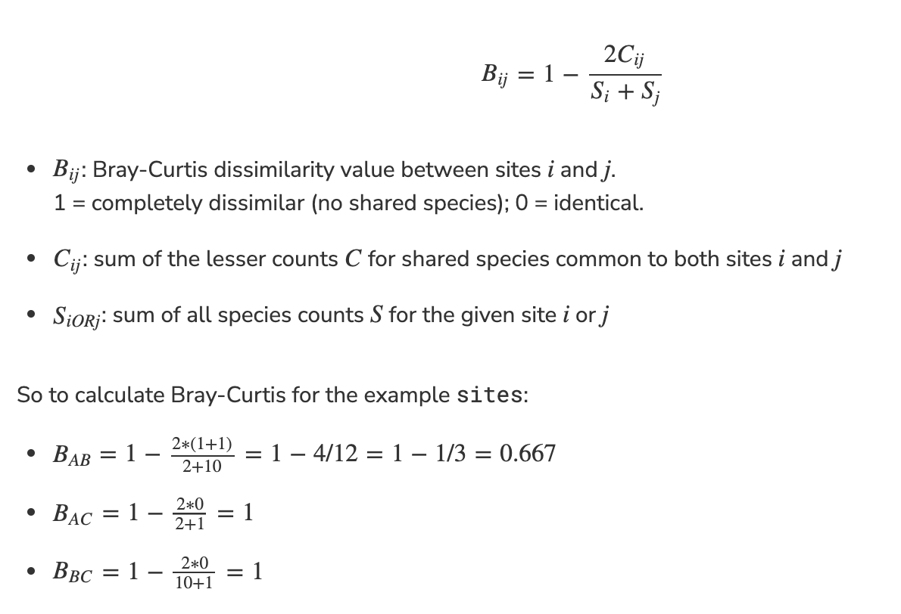
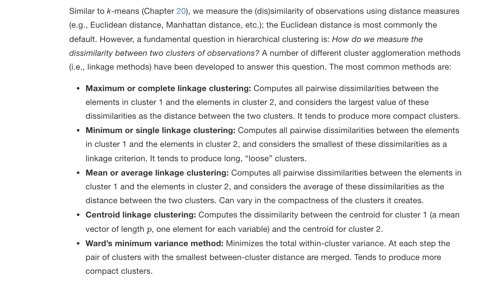

```{r setup, include=FALSE}
knitr::opts_chunk$set(echo = TRUE)
```

### Learning Objectives

### In this lab, you will play with unsupervised classification techniques while working with ecological community datasets.

- Comparing species counts between sites using distance metrics:
- Euclidean calculates the distance between a virtualized space using Pythagorean theorem.
- Manhattan calculates integer “around the block” difference.
- Bray-Curtis dissimilarity is based on the sum of lowest counts of shared species between sites over the sum of all species. A dissimilarity value of 1 is completely dissimilar, i.e. no species shared. A value of 0 is completely identical.

### Clustering

K-Means clustering with function kmeans() given a pre-assigned number of clusters assigns membership centroid based on reducing within cluster variation.
- Voronoi diagrams visualizes regions to nearest points, useful here to show membership of nodes to nearest centroid.
Hierarchical clustering allows for a non-specific number of clusters.
- Agglomerative hierarchical clustering, such as with diana(), agglomerates as it builds the tree. It is good at identifying small clusters.
- Divisive hierarchical clustering, such as with agnes(), divides as it builds the tree. It is good at identifying large clusters.
- Dendrograms visualize the branching tree.
Ordination (coming Monday)

## 1 Clustering

Clustering associates similar data points with each other, adding a grouping label. It is a form of unsupervised learning since we don’t fit the model based on feeding it a labeled response (i.e. y).

### 1.1 K-Means Clustering
Source: [K Means Clustering in R | DataScience+](https://datascienceplus.com/k-means-clustering-in-r/)

In k-means clustering, the number of clusters needs to be specified. The algorithm randomly assigns each observation to a cluster, and finds the centroid of each cluster. Then, the algorithm iterates through two steps:

1. Reassign data points to the cluster whose centroid is closest.
1. Calculate new centroid of each cluster.

These two steps are repeated until the within cluster variation cannot be reduced any further. The within cluster variation is calculated as the sum of the euclidean distance between the data points and their respective cluster centroids.

#### 1.1.1 Load and plot the iris dataset

```{r}
# load R packages
librarian::shelf(
  dplyr, DT, ggplot2, skimr, tibble)

# set seed for reproducible results
set.seed(42)

# load the dataset
data("iris")

# look at documentation in RStudio
if (interactive())
  help(iris)

# show data table
datatable(iris)
```

```{r}
# skim the table for a summary
skim(iris)
```

 
```{r}
# remove the rows with NAs
iris <- na.omit(iris)

# plot petal length vs width, species naive
ggplot(
  iris, aes(Petal.Length, Petal.Width)) +
  geom_point()
```

```{r}
# plot petal length vs width, color by species
legend_pos <- theme(
    legend.position = c(0.95, 0.05),
    legend.justification = c("right", "bottom"),
    legend.box.just = "right")
ggplot(
  iris, aes(Petal.Length, Petal.Width, color = Species)) +
  geom_point() +
  legend_pos
```

#### 1.1.2 Cluster iris using kmeans()

```{r}
# cluster using kmeans
k <- 3  # number of clusters
iris_k <- kmeans(
  iris %>% 
    select(Petal.Length, Petal.Width), 
  centers = k)

# show cluster result
iris_k
```

```{r}
# compare clusters with species (which were not used to cluster)
table(iris_k$cluster, iris$Species)
```

**Question: How many observations could be considered “misclassified” if expecting petal length and width to differentiate between species?**

**6 observations could be considered "misclassified" if we expect petal length and width to differentiate between species.**

```{r}
# extract cluster assignment per observation
Cluster = factor(iris_k$cluster)

ggplot(iris, aes(Petal.Length, Petal.Width, color = Cluster)) +
  geom_point() + 
  legend_pos
```

**Question: Comparing the observed species plot with 3 species with the kmeans() cluster plot with 3 clusters, where does this “unsupervised” kmeans() technique (that does not use species to “fit” the model) produce similar versus different results? One or two sentences would suffice. Feel free to mention ranges of values along the axes.**

**Comparing the observed species plot with 3 species with the kmeans() cluster plot with 3 clusters, the "unsupervised" kmeans() technique (that does not use species to "fit" the model) produces the same results for the setosa species on the lower end of the x-axis for petal length (within the range of 0-2), as well as for most of the points for the versicolor species within the range of 3-5 for petal length and for the virginica species within the range of 5-7 for petal length. However, the "unsupervised" kmeans() technique produces different results for species versicolor and virginica right around the value of 5 for petal length. There are a few points misidentified as the other species in both directions.**

#### 1.1.3 Plot Voronoi diagram of clustered iris

This form of clustering assigns points to the cluster based on nearest centroid. You can see the breaks more clearly with a [Voronoi diagram.](https://en.wikipedia.org/wiki/Voronoi_diagram)

```{r}
librarian::shelf(ggvoronoi, scales)

# this tribble part differs from the penguins code:
# define bounding box for geom_voronoi()
box <- tribble(
  ~Petal.Length, ~Petal.Width, ~group,
  1, 0.1, 1,
  1, 2.5, 1,
  7, 2.5, 1,
  7, 0.1, 1,
  1, 0.1, 1) %>% 
  data.frame()

# cluster using kmeans
k <- 3  # number of clusters
iris_k <- kmeans(
  iris %>% 
    select(Petal.Length, Petal.Width), 
  centers = k)

# extract cluster assignment per observation
Cluster = factor(iris_k$cluster)

# extract cluster centers
ctrs <- as.data.frame(iris_k$centers) %>% 
  mutate(
    Cluster = factor(1:k))

# plot points with voronoi diagram showing nearest centroid
ggplot(iris, aes(Petal.Length, Petal.Width, color = Cluster)) +
  geom_point() + 
  legend_pos +
  geom_voronoi(
    data = ctrs, aes(fill=Cluster), color = NA, alpha=0.5, outline = box) + 
  geom_point(
    data = ctrs, pch=23, cex=2, fill="black")
```

Task: Show the Voronoi diagram for fewer (k=2) and more (k=8) clusters to see how assignment to cluster centroids work.

```{r}
# cluster using kmeans with k = 2
k <- 2  # number of clusters
iris_k <- kmeans(
  iris %>% 
    select(Petal.Length, Petal.Width), 
  centers = k)

# extract cluster assignment per observation
Cluster = factor(iris_k$cluster)

# extract cluster centers
ctrs <- as.data.frame(iris_k$centers) %>% 
  mutate(
    Cluster = factor(1:k))

# plot points with voronoi diagram showing nearest centroid
ggplot(iris, aes(Petal.Length, Petal.Width, color = Cluster)) +
  geom_point() + 
  legend_pos +
  geom_voronoi(
    data = ctrs, aes(fill=Cluster), color = NA, alpha=0.5, outline = box) + 
  geom_point(
    data = ctrs, pch=23, cex=2, fill="black")
```

```{r}
# cluster using kmeans with k = 8
k <- 8  # number of clusters
iris_k <- kmeans(
  iris %>% 
    select(Petal.Length, Petal.Width), 
  centers = k)

# extract cluster assignment per observation
Cluster = factor(iris_k$cluster)

# extract cluster centers
ctrs <- as.data.frame(iris_k$centers) %>% 
  mutate(
    Cluster = factor(1:k))

# plot points with voronoi diagram showing nearest centroid
ggplot(iris, aes(Petal.Length, Petal.Width, color = Cluster)) +
  geom_point() + 
  legend_pos +
  geom_voronoi(
    data = ctrs, aes(fill=Cluster), color = NA, alpha=0.5, outline = box) + 
  geom_point(
    data = ctrs, pch=23, cex=2, fill="black")
```

### 1.2 Hierarchical Clustering

Next, you’ll cluster sites according to species composition. You’ll use the `dune` dataset from the `vegan` R package.

#### 1.2.1 Load dune dataset

```{r}
librarian::shelf(
  cluster, vegan)

# load dune dataset from package vegan
data("dune")

# show documentation on dataset if interactive
if (interactive())
  help(dune)
```

Question: What are the rows and columns composed of in the dune data frame?

**In the dune dataframe, the rows are composed of sites (n=20) and the columns are plant species (n=30).**

- This is similar to how the grocery items data set uses columns for grocery items and rows for grocery trips in lab 2b.

#### 1.2.2 Calculate Ecological Distances on sites

Before we calculate ecological distance between sites for dune, let’s look at these metrics with a simpler dataset, like the example given in Chapter 8 by Kindt and Coe (2005).

```{r}
sites <- tribble(
  ~site, ~sp1, ~sp2, ~sp3,
    "A",    1,    1,    0,
    "B",    5,    5,    0,
    "C",    0,    0,    1) %>% 
  column_to_rownames("site")
sites
```

```{r}
sites_manhattan <- vegdist(sites, method="manhattan")
sites_manhattan
```

Sites B & C have the largest manhattam distance between them. This aligns with the results of the euclidean distance, which shows the greatest distance between sites B & C. A & C have the smallest manhattan distance between them, which makes sense because 1 is close to 0, but the values of 5 for the B site is further from the 0 values at the C site. 

```{r}
sites_euclidean <- vegdist(sites, method="euclidean")
sites_euclidean
```

Sites B & C have the largest euclidean distance between them. Sites A and C have the smallest euclidean distance between them. This makes sense because the values of 5 for the B site result in a larger quantitative difference from 0 than the values of 1 for the A site. 

```{r}
sites_bray <- vegdist(sites, method="bray")
sites_bray
```
The Bray Curtis output shows that sites A & B are mostly but not completely dissimilar, as they align perfectly with species 3, but are very dissimilar for species 1 & 2. The Bray Curtis output shows that sites A & C are perfectly dissimilar as they are different (1 or 0) for every species. B & C are completely dissimilar as well, as they are different (5 or 0) for every species. The Euclidean distance output shows that sites B & C are much more dissimilar than sites A & C.

**Question: In your own words, how does Bray Curtis differ from Euclidean distance? See sites_euclidean versus sites_bray from lab code, slides from Lecture 05. Clustering and reading Chapter 8 of Kindt and Coe (2005).**

**Bray Curtis differs from Euclidean distance in that Euclidean distance uses the species as axes to plot each site and measures the distance between sites as the shortest path (a straight line), so it is best used for continuous data and reflects absolute distances, while Bray Curtis takes a normalization method that defines completely dissimilar sites as 1 and identical sites as 0 and is best used for categorical data and reflects relative magnitudes. The Bray Curtis site dissimilarity values range from 0-1 while Euclidean distance does not range from 0-1.**

#### 1.2.3 Bray-Curtis Dissimilarity on sites

Let’s take a closer look at the [Bray-Curtis Dissimilarity](https://en.wikipedia.org/wiki/Bray%E2%80%93Curtis_dissimilarity) distance:



#### 1.2.4 Agglomerative hierarchical clustering on dune

See text to accompany code: HOMLR [21.3.1 Agglomerative hierarchical clustering.](https://bradleyboehmke.github.io/HOML/hierarchical.html#agglomerative-hierarchical-clustering)

```{r}
# Dissimilarity matrix
d <- vegdist(dune, method="bray")
dim(d)
```

```{r}
as.matrix(d)[1:5, 1:5]
```
```{r}
# Hierarchical clustering using Complete Linkage
hc1 <- hclust(d, method = "complete" )

# Dendrogram plot of hc1
plot(hc1, cex = 0.6, hang = -1)
```

**Question: Which function comes first, vegdist() or hclust(), and why? See HOMLR 21.3.1 Agglomerative hierarchical clustering.**

**We first compute the dissimilarity values with vegdist() (in this case, we use Bray Curtis dissimilarity) and then feed these values into hclust() and specify that we want to use the "complete" agglomeration method. We use vegdist() first because this function does the actual computing of the dissimilarity indices, while the hclust() executes a hierarchial cluster analysis on this set of given dissimilarities.**

```{r}
# Compute agglomerative clustering with agnes
hc2 <- agnes(dune, method = "complete")

# Agglomerative coefficient
hc2$ac
```

```{r}
# Dendrogram plot of hc2
plot(hc2, which.plot = 2)
```
**Question: In your own words how does hclust() differ from agnes()? See HOMLR 21.3.1 Agglomerative hierarchical clustering and help documentation (?hclust(), ?agnes()).**

**hclust() differs from agnes() in that agnes also gives the agglomerative coefficient, which measures the amount of clustering structure found. Agglomerative coefficient values that are closer to 1 suggest a more balanced clustering structure like complete or ward, and values closer to 0 suggest poorly-informed clusters. The agglomerative coefficient is best applied to compare across data sets of similar sizes.**

```{r}
# methods to assess
m <- c( "average", "single", "complete", "ward")
names(m) <- c( "average", "single", "complete", "ward")

# function to compute coefficient
ac <- function(x) {
  agnes(dune, method = x)$ac
}

# get agglomerative coefficient for each linkage method
purrr::map_dbl(m, ac)
```

**Question: Of the 4 methods, which is the “best” model in terms of Agglomerative Coefficient?**

**The best model is ward in terms of the Agglomerative Coefficient.**



```{r}
# Compute ward linkage clustering with agnes
hc3 <- agnes(dune, method = "ward")

# Agglomerative coefficient
hc3$ac
```

```{r}
# Dendrogram plot of hc3
plot(hc3, which.plot = 2)
```

#### 1.2.5 Divisive hierarchical clustering on dune

See text to accompany code: [HOMLR 21.3.2 Divisive hierarchical clustering.](https://bradleyboehmke.github.io/HOML/hierarchical.html#divisive-hierarchical-clustering)

```{r}
# compute divisive hierarchical clustering
hc4 <- diana(dune)

# Divise coefficient; amount of clustering structure found
hc4$dc
```

**Question: In your own words how does agnes() differ from diana()? See HOMLR 21.3.1 Agglomerative hierarchical clustering, slides from Lecture 05. Clustering and help documentation (?agnes(), ?diana()).**

**The Divisive clustering approach using `diana()` produced a smaller coefficient, (`r hc4$dc`), that represents clustering structure found, compared to the coefficient produced by the agglomerative approach using `agnes()` (`r hc3$ac`). A coefficient closer to 1 suggests stronger group distinctions. Values closer to 0 suggest less well-formed clusters such as the single linkage dendrogram. The agglomerative coefficient tends to become larger as n increases, so it should only be used to compre data sets of similar sizes. The agglomerative approach is better at identifying smaller groups, starting at the bottom of the dendrogram and moving up, so the clustering coefficient is larger. The divisive clustering method works in a top-down manner, beginning at the root.**

#### 1.2.6 Determining optimal clusters

See text to accompany code: [HOMLR 21.4 Determining optimal clusters.](https://bradleyboehmke.github.io/HOML/hierarchical.html#determining-optimal-clusters)

```{r}
librarian::shelf(factoextra)

# Plot cluster results
p1 <- fviz_nbclust(dune, FUN = hcut, method = "wss",  k.max = 10) +
  ggtitle("(A) Elbow method")

p2 <- fviz_nbclust(dune, FUN = hcut, method = "silhouette", k.max = 10) +
  ggtitle("(B) Silhouette method")

p3 <- fviz_nbclust(dune, FUN = hcut, method = "gap_stat", k.max = 10) +
  ggtitle("(C) Gap statistic")

# Display plots side by side
gridExtra::grid.arrange(p1, p2, p3, nrow = 1)
```

**Question: How do the optimal number of clusters compare between methods for those with a dashed line?**

**The silhouettte method indicates that 4 is the optimal number of clusters, while the gap statistic indicates that 3 is the optimal number of clusters.**

#### 1.2.7 Working with dendrograms

See text to accompany code: [HOMLR 21.5 Working with dendrograms.](https://bradleyboehmke.github.io/HOML/hierarchical.html#working-with-dendrograms)

```{r}
# Construct dendorgram for the Ames housing example
hc5 <- hclust(d, method = "ward.D2" )
dend_plot <- fviz_dend(hc5)
dend_data <- attr(dend_plot, "dendrogram")
dend_cuts <- cut(dend_data, h = 8)
fviz_dend(dend_cuts$lower[[2]])
```

```{r}
# Ward's method
hc5 <- hclust(d, method = "ward.D2" )

# Cut tree into 4 groups
k = 4
sub_grp <- cutree(hc5, k = k)

# Number of members in each cluster
table(sub_grp)
```

```{r}
# Plot full dendogram
fviz_dend(
  hc5,
  k = k,
  horiz = TRUE,
  rect = TRUE,
  rect_fill = TRUE,
  rect_border = "jco",
  k_colors = "jco")
```
**Question: In dendrogram plots, which is the biggest determinant of relatedness between observations: the distance between observations along the labeled axes or the height of their shared connection? See HOMLR 21.5 Working with dendrograms.**

**The bigger detemrinant of relatedness between observations is the height of their shared connection.**


